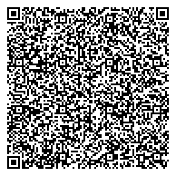

# Shell Matrix

Matrix 4 is coming out soon. *YAY!* 
Even tho I'm going to hate that movie, I have (finally) managed to replicate the old feeling of looking at the Matrix to take a look at what our hero Neo is up to.

## How to use

Simply download the file from [here](https://github.com/lorossi/shell-matrix/blob/cdcfdf570351df4f799374ab15c6507a1143dd0f/matrix.sh#L95), or clone the repo. Or scan the QR code. It's so small that it fits there!

Then, navigate into the folder containing the file and run it from the shell, using the command `./matrix.sh`.

## How does it work?

The characters are printed around thanks to the ANSI escape codes [(more on that here)](https://gist.github.com/fnky/458719343aabd01cfb17a3a4f7296797).
They are simply Japanese UTF-8 Hiragana.

I have also made a compressed *(by hand!)* version. It handles correctly the `SIGINT` routine and has the same features of the `matrix.sh` script. It is 673 **bytes** (!) big.

## Credits

This project is distributed under Attribution 4.0 International (CC BY 4.0) license.
